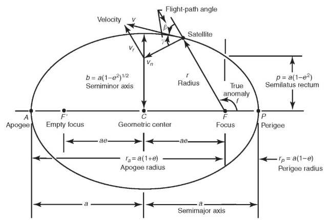

---
jupytext:
  text_representation:
    extension: .md
    format_name: myst
    format_version: 0.13
    jupytext_version: 1.14.1
kernelspec:
  display_name: Python 3
  language: python
  name: python3
---


# Orbit Elements


## The Two-Body Problem

Build up to this:
http://www.physics.drexel.edu/~steve/Courses/Physics-431/two-body.pdf
From Newton's Law of Gravitation (ref), the force of particle $P_1$ acting on particle $P_2$ in the intertial fram yields: 

Let r = r_2 - r_1

The Equation of Motion for the Two-Body Problem is:

:::{math}
:label: eq:Two_Body_EOM
\ddot{\mathbf{r}} = -G\frac{(m_1+m_2)}{r^3}\mathbf{r}
:::

where:

<!-- :::{math}
M = m_1 + m_2
::: -->

:::{math}
\mathbf{r} = \mathbf{r_{12}} = \mathbf{r_2} - \mathbf{r_1}
:::

State Vector:

:::{math}
:label: eq:state_vector
\mathbf{\bar{x}} = \begin{bmatrix} 
    \mathbf{x} \\ \mathbf{y} \\ \mathbf{z} \\
    \mathbf{\dot{x}} \\ \mathbf{\dot{y}} \\ \mathbf{\dot{z}}
\end{bmatrix}
:::

This is a second-order differential equation which requires solving 6 intergrals of motion. Which have become to be known as the Classical Orbital Elements. They can be found solved by positions, velocities, and times that remain constant under the motion governed by the equations of motion.


```{note}
The term $G(m_1+m_2)$ comes up quite often in our Equations of Motion that is convient to define it as teh Gravitation Constant ($\mu$)

:::{math}
\mu = G(m_1+m_2)
:::
```

##### Classical Orbital Elements

:$a$: Semi-Major Axis
:$e$: Eccentricity
:$i$: Incliniation
:$\Omega$: Longitude of Ascending Node
:$\omega$: Argument of Periapsis
:$t_0$: Time of Periapsis Passage

They can be broken down even further as to how they define the shape, and size of the orbit, orientation of orbital plane, and definition of periapsis. 


For the remainder of this course, we will consider the second object being a sat. 


NOTE: Here it might be a good idea to descrbing the elements more and create some sort of animation

#### Elements defining the shape and size of the orbit



[source](https://space.stackexchange.com/questions/28361/spiraling-out-from-circular-orbit-to-escape-via-low-thrust-what-is-%CE%B3-gamma#:~:text=by%20uhoh%27s%20comment-,Source,-It%20is%20just)
##### Semi-Major Axis

```{code-cell} ipython3
:tags: ["remove-input"]
import elliptic_orbit_semimajor
fig = elliptic_orbit_semimajor.plot()
fig.show()
```

##### Eccentricity

Describe elements and and figures/animations

#### Elements defing the orientation of the orbital plane in which the plane is embedded
##### Incliniation
##### Longitude of Ascending Node

Describe elements and and figures/animations

#### Elements defining orientaion of periasis
##### Argument of Periapsis
##### Time of Periapsis Passage

Describe elements and and figures/animations
